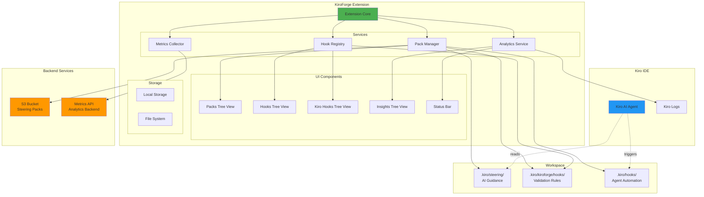
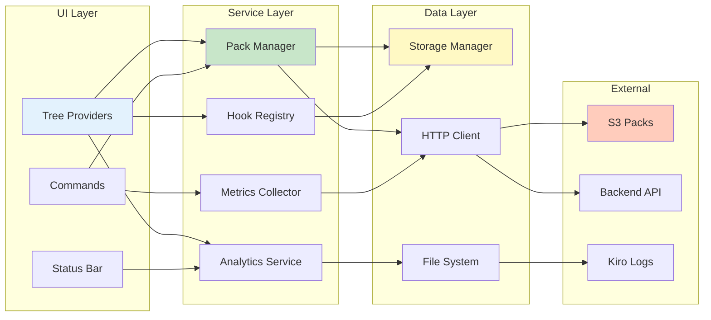
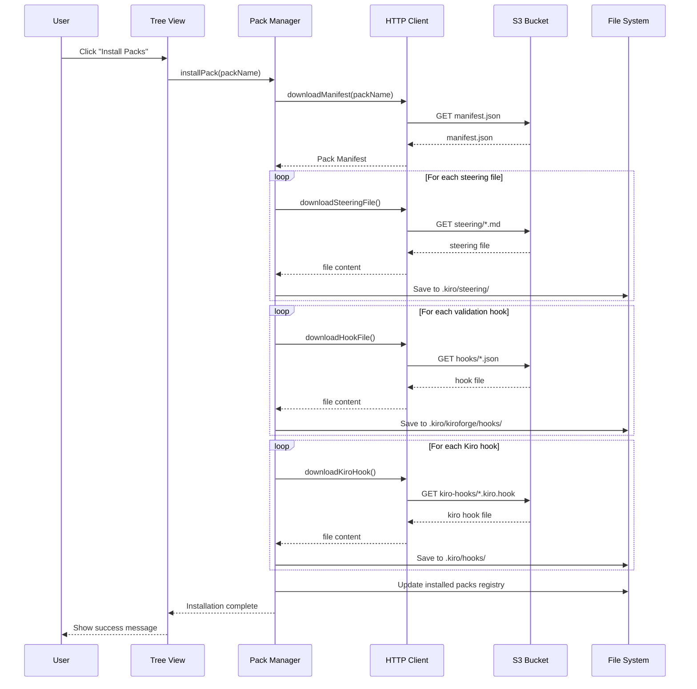
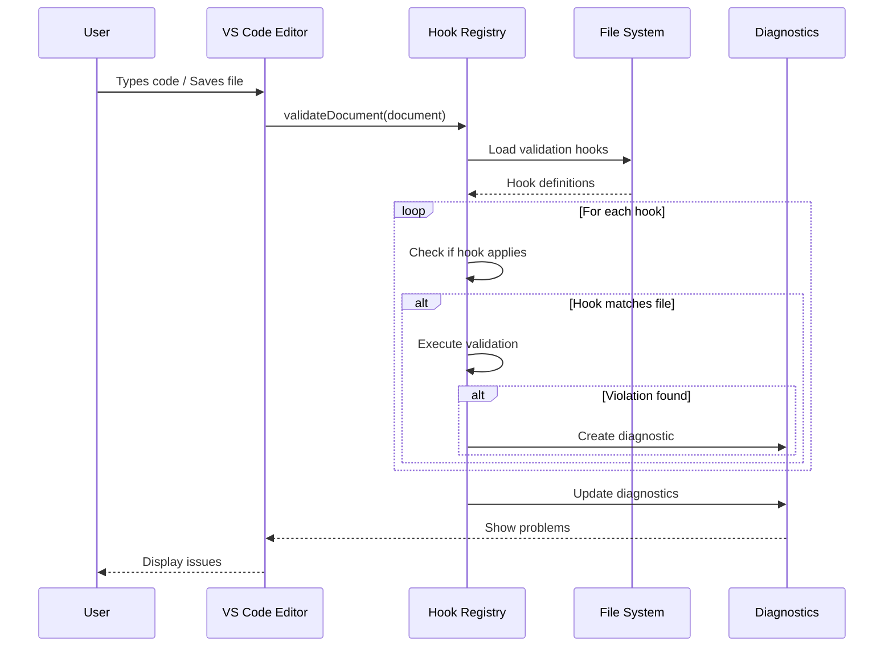
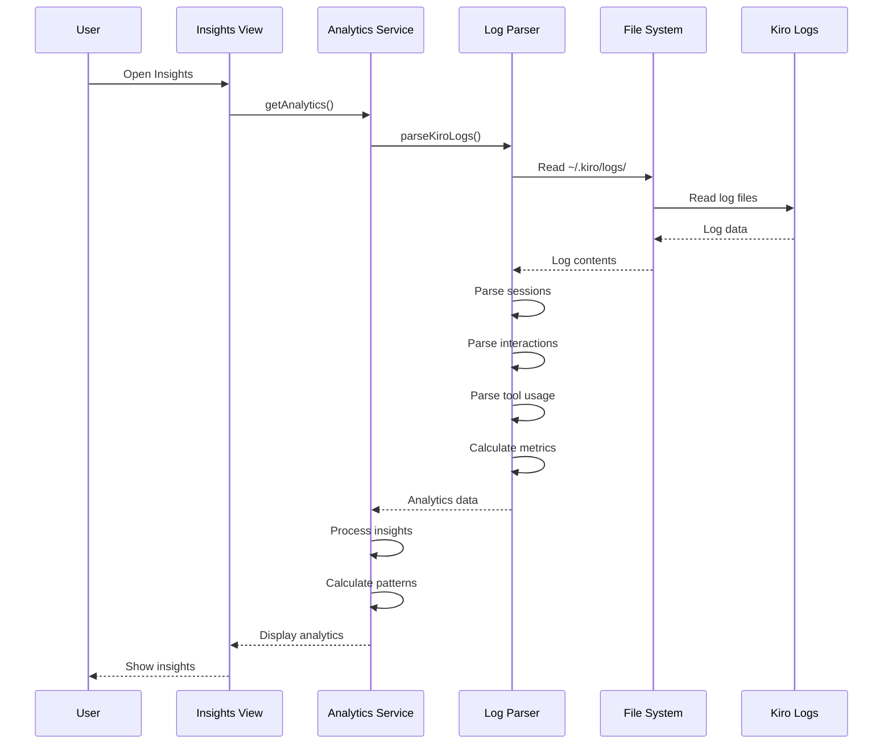

# KiroForge Extension v1.3.0

KiroForge is a **Kiro IDE extension** that brings **organizational coding quality standards**, **Kiro Agent Hooks**, and **productivity insights** directly into Kiro IDE through steering packs, validation hooks, and analytics.

## 🎉 What's New in v1.3.0

- **🎯 Kiro Agent Hooks Support**: Full integration with Kiro IDE's agent automation system
  - New "Kiro Agent Hooks" sidebar view for managing automation hooks
  - Automatic installation with steering packs that include hooks
  - Click any hook to open and edit in the editor
  - Hooks stored in `.kiro/hooks/` with `.kiro.hook` extension
- **✨ Better UX**: Consistent welcome messages and improved terminology
  - Fixed grammar across all tree views
  - "No skills installed" instead of "No hooks installed" in Quality Skills
  - Added "Install Packs" buttons to all empty views for easy onboarding
- **🔧 Code Quality**: Cleaned up build artifacts and optimized package size (407 KB)

## 🔄 How KiroForge Complements Kiro IDE

**Kiro IDE's Built-in Steering** (`.kiro/steering/`):
- Guides Kiro AI for code generation
- Defines workspace conventions and patterns
- Specifies libraries and architecture

**KiroForge Organizational Steering Packs**:
- Validates code quality in real-time
- Enforces organizational standards
- Detects security vulnerabilities
- Tracks code quality metrics

**Together**: Kiro generates code following your conventions, KiroForge validates it meets your quality standards.

## ⚠️ Before Uninstalling

**IMPORTANT**: Before uninstalling KiroForge, clean up workspace data:

1. Open Command Palette (Cmd+Shift+P / Ctrl+Shift+P)
2. Run: **"KiroForge: Remove Workspace Data"**
3. Confirm removal
4. Then uninstall the extension

This removes:
- `.kiro/kiroforge/` directory (KiroForge-specific)
- KiroForge-installed files from `.kiro/steering/`
- All validation hooks and diagnostics

**Your files are safe**: User-created files in `.kiro/steering/` are preserved.

## Features

### 🎯 Kiro Agent Hooks (NEW in v1.3.0)
- **Automated Workflows**: Hooks that trigger on IDE events
  - `onMessageSend` - When sending messages to Kiro
  - `onSessionStart` - When starting a new session
  - `onFileSave` - When saving files
  - `onAgentComplete` - When agent execution completes
- **Easy Management**: View and edit hooks in the "Kiro Agent Hooks" sidebar
- **Pack Integration**: Hooks are automatically installed with packs

### Code Quality & Standards
- **Organizational Steering Packs**: Install coding quality standards for your organization
  - General Code Quality (no console.log, no task comments, etc.)
  - JavaScript/TypeScript Standards
  - Python Best Practices
  - React/Vue/Angular Rules
  - Security Vulnerability Detection
  - Documentation Requirements
- **Real-time Validation**: Validate code files against organizational standards as you type
- **Issues Panel**: View validation violations in Kiro IDE Problems panel
- **Quality Skills**: Automated code validation on save

### 📊 Productivity Analytics (Enhanced in v1.3.0)
- **Kiro Insights**: Comprehensive analytics dashboard showing:
  - Interactions (Human-Bot-Tool) tracking
  - Chat sessions and activity patterns
  - Tool usage patterns and percentages
  - Activity patterns (hourly, daily, weekly)
  - Productivity insights (most productive hours/days)
  - Workspace-specific analytics with clickable navigation
- **Beautiful Status Bar**: Colorful tooltips with horizontal layout
  - 💬 Interactions count
  - 🗨️ Chats count
  - ⏰ Peak usage time (AM/PM format)
- **Export Analytics**: Export your productivity data for further analysis

### Team Collaboration
- **Metrics Collection**: Track code quality metrics across your team
- **Team Detection**: Automatic team identification from Git configuration
- **Offline Support**: Queue metrics when offline, sync when connected

### Integration & Configuration
- **Kiro IDE Integration**: Works alongside Kiro's built-in steering feature
- **Configurable**: Customize API endpoints, enable/disable features
- **Real-time Updates**: Automatic refresh of insights and validation

## Installation

### From VSIX (Recommended)
1. Download the `.vsix` file
2. Open **Kiro IDE**
3. Go to Extensions view (Ctrl+Shift+X)
4. Click "..." menu → "Install from VSIX..."
5. Select the downloaded `.vsix` file

### From Source
```bash
cd extension
npm install
npm run compile
npm run package
```

## Configuration

### Getting Your Configuration Values

After deploying the KiroForge backend with CloudFormation, you'll need to configure the extension with three values from your deployment:

1. **Deploy the Backend**: Follow the deployment instructions on the KiroForge website
2. **Get Your Configuration Values**:
   - Go to AWS Console → CloudFormation
   - Select your KiroForge stack
   - Click the **Outputs** tab
   - Copy these three values:
     - **UserApiKey** - Your unique API key
     - **ApiUrl** - Your API Gateway endpoint
     - **SteeringPacksBucketUrl** - Your S3 bucket URL for packs
3. **Configure the Extension**:
   - Open Kiro IDE Settings (Cmd+, or Ctrl+,)
   - Search for "KiroForge"
   - Paste the values into their respective fields:
     - **Kiroforge: Api Key** ← UserApiKey
     - **Kiroforge: Api Url** ← ApiUrl
     - **Kiroforge: Packs Url** ← SteeringPacksBucketUrl

### Configuration Settings

Configure KiroForge in Kiro IDE settings:

```json
{
  "kiroforge.apiUrl": "your-backend-api-url",
  "kiroforge.packsUrl": "your-packs-storage-url",
  "kiroforge.apiKey": "your-api-key-from-cloudformation",
  "kiroforge.enableMetrics": true,
  "kiroforge.enableHooks": true,
  "kiroforge.enableRealtimeValidation": true,
  "kiroforge.validationDelay": 500
}
```

### Configuration Options

**Required Configuration (from CloudFormation Outputs):**
- **apiKey**: Your unique API key (from CloudFormation Outputs → UserApiKey)
- **apiUrl**: Backend API endpoint for metrics (from CloudFormation Outputs → ApiUrl)
- **packsUrl**: S3 URL for steering packs (from CloudFormation Outputs → SteeringPacksBucketUrl)

**Optional Configuration:**
- **enableMetrics**: Enable/disable metrics collection (default: true)
- **enableHooks**: Enable/disable validation hooks (default: true)
- **enableRealtimeValidation**: Enable/disable real-time validation as you type (default: true)
- **validationDelay**: Delay in milliseconds before validating after typing stops (default: 500ms, range: 100-5000ms)
- **maxFileSizeForValidation**: Maximum file size in lines for validation (default: 5000 lines)
- **hookTimeout**: Timeout in milliseconds for hook execution (default: 2000ms)
- **teamName**: Team name for metrics aggregation (optional, auto-detected from Git)

**Important**: All three required values are unique to your deployment and should be kept secure. Never commit them to version control.

## Usage

### KiroForge Sidebar

KiroForge adds a dedicated sidebar with three views:

#### 1. Approved Steering
- View installed steering packs
- Install new packs from the registry
- Uninstall packs you no longer need
- Open steering files directly
- Refresh to check for updates

#### 2. Quality Skills
- View installed validation hooks
- See which hooks are active
- Open hook configuration files
- Manage code quality rules

#### 3. Kiro Agent Hooks
- View installed Kiro IDE agent hooks
- Click to open and edit hook files
- Hooks are stored in `.kiro/hooks/` with `.kiro.hook` extension
- Installed automatically with steering packs that include them
- Separate from KiroForge validation hooks

#### 4. Kiro Insights
- View productivity analytics
- See interaction patterns
- Analyze tool usage
- Track activity patterns
- View workspace-specific metrics
- Export analytics data

### Installing Steering Packs

1. Open Command Palette (Ctrl+Shift+P)
2. Run "KiroForge: Install Steering Packs"
3. Select packs to install
4. Wait for installation to complete

Or use the sidebar:
1. Click the KiroForge icon in the Activity Bar
2. In the "Approved Steering" view, click the download icon
3. Select packs to install

### Viewing Issues

1. **Automatic**: Issues appear as you type (real-time validation)
2. **On Startup**: All open files are scanned automatically
3. **Manual Scan**: Run "KiroForge: Scan Workspace for Issues"
4. **View Issues**: Problems panel (Ctrl+Shift+M) or "KiroForge: Show Issues"

### Viewing Analytics

1. **Sidebar**: Click the KiroForge icon, then view "Kiro Insights"
2. **Status Bar**: Click the insights icon in the status bar
3. **Command Palette**: Run "KiroForge: Show Insights Quick Pick"

### Managing Packs

- **Refresh Packs**: Check for updates
- **View Installed Packs**: See packs in the sidebar
- **Uninstall Packs**: Click the trash icon next to installed packs
- **Open Files**: Click on steering files to view/edit them

## Commands

### Pack Management
- `KiroForge: Install Steering Packs` - Install new packs
- `KiroForge: Refresh Packs` - Check for pack updates
- `KiroForge: Reset Installed Packs` - Reset packs list (use if packs are out of sync)

### Validation
- `KiroForge: Scan Workspace for Issues` - Scan all open files for violations
- `KiroForge: Show Issues` - Open Problems panel
- `KiroForge: Clear All Issues` - Clear all KiroForge issues from Problems panel

### Analytics & Insights
- `KiroForge: Refresh Insights` - Refresh analytics data
- `KiroForge: Export Analytics` - Export productivity insights to JSON
- `KiroForge: Show Insights Quick Pick` - Quick access to insights

### Metrics
- `KiroForge: Toggle Metrics Collection` - Enable/disable metrics collection
- `KiroForge: Show Metrics Status` - View metrics collection status and offline queue
- `KiroForge: Retry Offline Metrics` - Manually retry sending queued metrics

### Settings
- `KiroForge: Open Settings` - Configure KiroForge
- `KiroForge: Test Connection` - Test connectivity to services
- `KiroForge: Remove Workspace Data` - Clean up .kiro directory before uninstalling
- `KiroForge: Show Welcome Page` - Display welcome and setup information

## Directory Structure

KiroForge uses the following directory structure in your workspace:

```
.kiro/
├── steering/              # AI steering rules (managed by KiroForge)
│   └── *.md              # Markdown files with AI guidance
│
├── kiroforge/            # KiroForge-specific data
│   └── hooks/            # Validation hooks (managed by KiroForge)
│       └── *.json        # Hook definitions for code validation
│
└── hooks/                # Kiro IDE Agent Hooks (NOT managed by KiroForge)
    └── *.json            # Agent automation hooks (managed by Kiro IDE)
```

**Important**:
- `.kiro/hooks/` is reserved for Kiro IDE's native Agent Hooks system
- KiroForge validation hooks are stored in `.kiro/kiroforge/hooks/`
- These are two separate systems serving different purposes

## Steering Packs

KiroForge supports three categories of steering packs:

### Web Development
- React best practices
- TypeScript guidelines
- Testing standards

### Infrastructure
- AWS CDK patterns
- Docker best practices
- Security guidelines

### Development Tools
- Git workflow
- Python standards

## Validation Hooks

Hooks validate your code in real-time as you type (with configurable debounce):

- **Regex Validation**: Pattern matching in code
- **Filename Validation**: File naming conventions
- **Filesize Validation**: File size limits
- **AST Validation**: Code structure analysis (coming soon)

### Real-Time Validation

KiroForge validates your code as you type with intelligent debouncing:
- **Automatic**: Validates 500ms after you stop typing (configurable)
- **Performance**: Debounced to avoid lag while typing
- **Configurable**: Adjust delay or disable real-time validation
- **On Save**: Always validates on file save regardless of real-time setting

## Kiro IDE Agent Hooks

KiroForge now supports **Kiro IDE Agent Hooks** - automation triggers that can be installed with steering packs.

### What Are Kiro Agent Hooks?

Kiro Agent Hooks are automation triggers for Kiro IDE's AI agent that:
- Execute automatically based on events (file save, message send, etc.)
- Can send messages to the agent or run shell commands
- Are defined in `.kiro.hook` files with a specific format
- Are separate from KiroForge's validation hooks

### Installation

Kiro Agent Hooks are installed automatically when you install a steering pack that includes them:

1. Install a pack that includes Kiro hooks
2. Hooks are downloaded to `.kiro/hooks/` directory
3. View them in the "Kiro Agent Hooks" sidebar view
4. Click any hook to open and edit it

### File Format

Kiro Agent Hooks use the `.kiro.hook` extension and follow this naming pattern:
- Format: `xxx-xxx.kiro.hook` (kebab-case with at least one hyphen)
- Examples: `on-save-test.kiro.hook`, `format-code.kiro.hook`

### Viewing Installed Hooks

1. Open the KiroForge sidebar
2. Expand the "Kiro Agent Hooks" section
3. Click any hook to open it in the editor
4. Use the refresh button to reload the list

### Hook Storage

- **Location**: `.kiro/hooks/` directory
- **Managed By**: Kiro IDE (not KiroForge validation system)
- **Persistence**: Hooks remain until the pack is uninstalled
- **Editing**: You can edit hooks directly in the editor

### Difference from Validation Hooks

| Feature | Validation Hooks | Kiro Agent Hooks |
|---------|-----------------|------------------|
| **Purpose** | Code quality validation | Agent automation |
| **Location** | `.kiro/kiroforge/hooks/` | `.kiro/hooks/` |
| **Format** | `.json` | `.kiro.hook` |
| **Managed By** | KiroForge | Kiro IDE |
| **Execution** | Real-time validation | Event-triggered automation |

## Metrics

KiroForge collects anonymous usage metrics to help improve the product:

### What's Collected
- Hook violations (rule ID, severity, file type)
- Steering file usage (file accessed, operation type)
- Pack installations (pack name, version, success/failure)
- AI operations (when available)

### Privacy
- **Anonymized**: Developer IDs are hashed
- **No Source Code**: Only metadata is collected
- **Opt-Out Available**: Disable anytime in settings

### Offline Support
- **Automatic Queuing**: Metrics are queued when backend is unavailable
- **Exponential Backoff**: Retries with increasing intervals (5min, 10min, 20min, 60min)
- **Persistent Storage**: Queue survives VS Code restarts
- **Automatic Retry**: Queued metrics are sent when connection is restored
- **Manual Retry**: Use "Retry Offline Metrics" command to force retry

### Controlling Metrics

#### Disable Metrics Collection
```json
{
  "kiroforge.enableMetrics": false
}
```

Or use Command Palette:
1. Open Command Palette (Ctrl+Shift+P)
2. Run "KiroForge: Toggle Metrics Collection"
3. Metrics will be disabled

#### Check Metrics Status
1. Open Command Palette
2. Run "KiroForge: Show Metrics Status"
3. View:
   - Enabled/Disabled status
   - Online/Offline status
   - Offline queue size

#### Retry Offline Metrics
If metrics are queued offline:
1. Open Command Palette
2. Run "KiroForge: Retry Offline Metrics"
3. Queued metrics will be sent immediately

## Troubleshooting

### Extension Not Activating
- Check VS Code version (requires 1.74.0+)
- Check extension logs in Output panel

### Packs Not Installing
- Verify internet connection
- Check S3 URL in settings
- Run "KiroForge: Test Connection"

### Packs Show as Installed But Files Are Missing
- This happens if you manually deleted pack files
- Run "KiroForge: Reset Installed Packs" to clear the state
- Then reinstall your packs

### Hooks Not Validating
- Ensure `kiroforge.enableHooks` is true
- Check that packs are installed
- Verify file types match hook definitions
- For real-time validation, ensure `kiroforge.enableRealtimeValidation` is true

### Real-Time Validation Too Slow/Fast
- Adjust `kiroforge.validationDelay` (default: 500ms)
- Lower value = faster validation but more CPU usage
- Higher value = slower validation but better performance
- Disable with `kiroforge.enableRealtimeValidation: false` to validate only on save

### Issues Not Clearing After Fixing Code
- Save the file again to re-validate
- Issues are automatically cleared when no violations found
- Deleted files automatically have their issues cleared
- Renamed files are automatically re-validated
- Use `KiroForge: Clear All Issues` to manually clear all issues

### Metrics Not Sending
- Ensure `kiroforge.enableMetrics` is true
- Check API URL and API key in settings
- Verify backend API is running
- Check metrics status: Run "KiroForge: Show Metrics Status"
- If offline queue is growing, metrics will be sent when connection is restored
- Manually retry: Run "KiroForge: Retry Offline Metrics"

### Offline Queue Growing
- Normal behavior when backend is unavailable
- Metrics will be sent automatically when connection is restored
- Queue is limited to 100 metrics (oldest are dropped if exceeded)
- Metrics retry with exponential backoff (5min, 10min, 20min, 60min)
- After 4 failed attempts, metrics are dropped

### Insights Not Showing
- Ensure Kiro IDE is generating log files in `~/.kiro/logs/`
- Check that you have some Kiro activity (sessions, interactions)
- Run "KiroForge: Refresh Insights" to reload data
- Check Output panel (View → Output → KiroForge) for errors

### Insights Data Seems Incorrect
- Insights are calculated from Kiro log files
- Data is updated when logs are parsed
- Refresh insights to get latest data
- Check that log files are not corrupted

### Workspace Not Clickable in Insights
- Ensure the workspace path still exists
- Workspace must be a valid directory
- Check that you have permissions to access the workspace

## Development

### Building
```bash
npm install
npm run compile
```

### Watching
```bash
npm run watch
```

### Packaging
```bash
npm run package
```

### Testing
```bash
npm test
```

## Architecture

### System Overview



### Component Architecture



### Data Flow - Pack Installation



### Data Flow - Code Validation



### Data Flow - Analytics



### Extension Structure
```
extension/
├── src/
│   ├── extension.ts              # Main entry point
│   ├── services/
│   │   ├── PackManager.ts        # Pack management
│   │   ├── HookRegistry.ts       # Hook validation
│   │   ├── LogParser.ts          # Kiro log parsing
│   │   ├── MetricsCollector.ts   # Metrics collection
│   │   └── KiroAnalyticsService.ts # Analytics processing
│   ├── ui/
│   │   ├── PacksTreeProvider.ts  # Steering packs view
│   │   ├── HooksTreeProvider.ts  # Quality skills view
│   │   ├── InsightsTreeProvider.ts # Analytics tree view
│   │   ├── InsightsStatusBar.ts  # Status bar integration
│   │   ├── WelcomePage.ts        # Welcome page
│   │   └── UninstallPage.ts      # Uninstall cleanup
│   ├── models/
│   │   ├── Pack.ts               # Pack data models
│   │   ├── Hook.ts               # Hook data models
│   │   ├── Metric.ts             # Metric data models
│   │   └── Analytics.ts          # Analytics data models
│   └── utils/
│       ├── storage.ts            # Local storage
│       ├── http.ts               # HTTP client
│       └── teamDetector.ts       # Team identification
├── analytics-research/           # Research & testing scripts
│   ├── README.md                 # Research documentation
│   └── *.js                      # Analysis scripts
├── docs/                         # Documentation
│   ├── README.md                 # Documentation index
│   └── *.md                      # Feature & release docs
├── package.json                  # Extension manifest
└── tsconfig.json                 # TypeScript config
```

### Workspace Structure
```
.kiro/
├── steering/                 # AI steering rules
│   └── *.md                 # Guidance for AI agent
│
├── kiroforge/               # KiroForge extension data
│   └── hooks/               # Validation hooks
│       └── *.json           # Code validation rules
│
└── hooks/                   # Kiro IDE Agent Hooks (separate system)
    └── *.json               # Agent automation triggers
```

## License

MIT

## Uninstalling

To completely remove KiroForge from your workspace:

### Important: VS Code Uninstall Process
**Note**: VS Code shows "Restart Extension" after uninstalling, but you must **Reload VS Code** (Ctrl+R / Cmd+R) or **Restart VS Code** for the extension to be fully removed. This is standard VS Code behavior for all extensions.

### Option 1: Automatic Cleanup (Recommended)
1. Click "Uninstall" on KiroForge extension
2. When prompted, choose "Remove Data" to clean up workspace files
3. **Reload VS Code** (Ctrl+R / Cmd+R) or **Restart VS Code**
4. Extension will be removed from the extensions list

### Option 2: Manual Cleanup
1. Run command: `KiroForge: Remove Workspace Data`
2. Confirm the removal when prompted
3. Click "Uninstall" on the extension from Extensions view
4. **Reload VS Code** (Ctrl+R / Cmd+R) or **Restart VS Code**
5. Extension will be removed from the extensions list

### What Gets Removed
- `.kiro/steering/` - Installed steering files
- `.kiro/kiroforge/hooks/` - KiroForge validation hook definitions
- All KiroForge workspace data

### What Stays (Until Reload)
- `.kiro/hooks/` - Kiro IDE Agent Hooks (separate system, not managed by KiroForge)
- Extension appears in extensions list until you reload VS Code (normal VS Code behavior)
- Extension settings in VS Code (can be removed manually from settings)
- Global extension state (automatically cleaned by VS Code after reload)

**Important Notes**:
- **VS Code Behavior**: Extension remains in the list until you reload/restart VS Code. This is normal for all VS Code extensions.
- **KiroForge Data**: KiroForge uses `.kiro/kiroforge/` and `.kiro/steering/` for its data. The `.kiro/hooks/` directory is reserved for Kiro IDE's native Agent Hooks system and is NOT managed by KiroForge.
- **Keep Data Option**: If you want to keep your steering packs and validation hooks for future use, choose "Keep Data" when prompted during uninstallation.

## Support

For issues or questions:
- Check the troubleshooting section
- Review extension logs
- Contact support team

## Kiro Insights

KiroForge includes a comprehensive analytics dashboard that helps you understand your productivity patterns:

### Overview
- **Average Interactions per Session**: Track your engagement level with Kiro

### Interactions Analysis
- **Average per Session**: How many interactions you typically have
- **Average Messages per Interaction**: Conversation depth metric
- **Deepest Session**: Your most engaged session
- **Session Depth Categories**: Distribution across shallow, medium, deep, and very deep sessions

### Tool Usage
- **Percentage-based metrics**: See which tools you use most
- **Visual indicators**: Bar graphs show relative usage

### Activity Patterns
- **Hourly Patterns**: When you're most active during the day (percentage-based)
- **Daily Patterns**: Which days you work most (percentage-based)
- **Weekly Patterns**: Week-over-week activity trends (percentage-based)

### Productivity Insights
- **Most Productive Hours**: Your peak productivity times (percentage-based)
- **Most Productive Days**: Your most productive days (percentage-based)

### Workspace Analytics
- **Per-workspace insights**: Click any workspace to see detailed analytics
- **Workspace comparison**: Compare activity across different projects

### Exporting Data
Export your analytics to JSON for further analysis:
1. Click the export icon in the Insights view
2. Choose a location to save the JSON file
3. Analyze with your preferred tools

## Version History

### 1.3.0 (2024-11-22)
- **🎯 Kiro Agent Hooks Support**: Full integration with Kiro IDE's agent automation system
  - New "Kiro Agent Hooks" sidebar view
  - Automatic installation/uninstallation with packs
  - Click to open and edit `.kiro.hook` files
  - Stored in `.kiro/hooks/` directory
- **✨ UI/UX Improvements**: Consistent welcome messages across all tree views
  - Fixed grammar: "No steering installed" (not "steerings")
  - Changed "No hooks installed" to "No skills installed" in Quality Skills view
  - Added "Install Packs" call-to-action buttons to all empty views
- **🔧 Code Quality**: Cleaned up build artifacts and old package versions
- **📦 Package Size**: Optimized to 407 KB

### 1.2.2 (2024-11-21)
- **Kiro Insights**: Comprehensive productivity analytics dashboard
- **Simplified UI**: Streamlined metrics focusing on actionable insights
- **Percentage-based metrics**: All activity patterns show percentages
- **Workspace navigation**: Click workspaces to view detailed analytics
- **Export functionality**: Export analytics data to JSON
- **Status bar integration**: Quick access to insights
- **Organized project structure**: Separated research scripts and documentation

### 1.2.1
- Bug fixes and performance improvements
- Enhanced metrics collection
- Improved offline support

### 1.2.0
- Metrics collection with offline queue
- Team detection from Git
- Real-time validation improvements
- Enhanced hook system

### 1.1.0
- Real-time validation as you type
- Configurable validation delay
- File size limits for validation
- Hook timeout configuration

### 1.0.0 (2024-11-15)
- Initial release
- Steering pack management
- Hook validation
- Metrics collection
- VS Code integration
